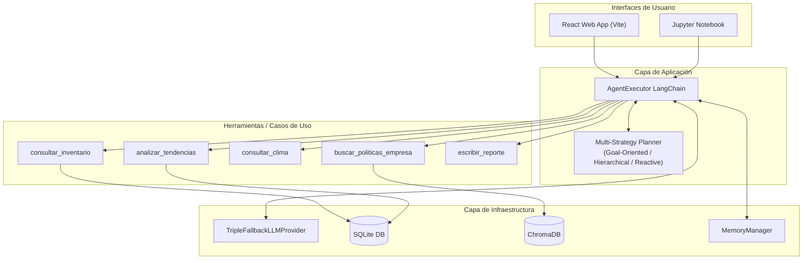

# Arquitectura del Sistema

El agente de inventario OmniRetail está diseñado utilizando **Clean Architecture**. Esta decisión garantiza que el agente sea agnóstico a la base de datos, al modelo LLM y a la interfaz de usuario.

## Diagrama de Flujo y Orquestación

## Flujo de Orquestación (Cómo piensa el agente)

1. **Recepción del Input**: Streamlit captura el mensaje del usuario y lo envía al `AgentExecutor`.
2. **Planificación Dinámica**: Si la consulta solicita planificación, se selecciona y ejecuta la estrategia adecuada (`GoalOrientedPlanner`, `HierarchicalPlanner` o `ReactivePlanner`) basándose en palabras clave de la entrada. El planificador descompone el objetivo en pasos priorizados.
3. **Recuperación de Contexto**: El `MemoryManager` inyecta la ventana de conversación anterior (últimos 10 mensajes) en el prompt del agente.
4. **Ejecución y Razonamiento (ReAct)**:
    - El LLM evalúa qué herramienta usar.
    - Llama a `consultar_clima` y descubre una alerta.
    - Llama a `consultar_inventario` y `analizar_tendencias` para cruzar datos.
    - Llama a `buscar_politicas_empresa` para validar la regla de negocio frente a la alerta climática.
5. **Acción Final**: Una vez obtenida la respuesta justificada, invoca `escribir_reporte` y responde al usuario en la interfaz.
