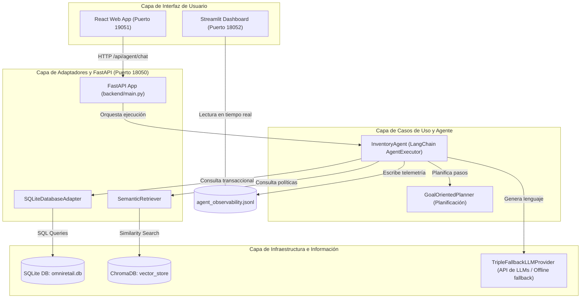

# Informe Técnico Final: Consolidación de Solución de Agente de IA y RAG (EFT)
## Agente de Gestión de Inventario — OmniRetail S.A.

**Asignatura:** Ingeniería de Soluciones con Inteligencia Artificial (ISY0101)  
**Evaluación:** Examen Final Transversal (EFT)  
**Estudiante:** Héctor Águila  
**Fecha:** Julio 2026

---

## 1. Análisis del Caso Organizacional (IE4, IE8)

### 1.1 Contexto de la Organización y Desafíos
**OmniRetail S.A.** es una gran cadena de comercio minorista chilena con sucursales a nivel nacional. La empresa enfrenta pérdidas operativas significativas debido a dos problemas en la gestión de su inventario:
1.  **Quiebres de stock (Stockouts)**: Especialmente críticos en productos con alta demanda estacional.
2.  **Sobreinventario (Overstock)**: Que inmoviliza capital y eleva los costos de almacenamiento.

Las decisiones se tomaban analizando manualmente planillas desconectadas (ventas históricas, inventario físico) y políticas en lenguaje natural (coberturas ideales, reglas de reposición). El desafío era diseñar una solución que automatice y asista de forma inteligente a los jefes de tienda en sus decisiones de reabastecimiento en menos de 5 minutos, considerando factores externos como el clima.

---

## 2. Diseño de la Solución Basada en LLM y RAG

### 2.1 Formulación y Optimización de Prompts (IE1)
Para garantizar la precisión de las respuestas del agente, se definió un prompt de sistema estructurado para el agente en [backend/src/application/agent.py](file:///Users/user/Desktop/SolucionesIA/SolucionesIA/backend/src/application/agent.py#L22-L45) que delimita sus fronteras de acción:
*   **Role-prompting**: Eres ALI (Agente de Logística Inteligente) de OmniRetail S.A.
*   **Context Bounding**: Solo puedes responder preguntas basándote en la base de datos local de SQLite y en los fragmentos de políticas recuperados vía RAG. Si un dato no existe, di "No dispongo de esa información".
*   **Fórmulas Obligatorias**: Aplica estrictamente las reglas de la guía corporativa para calcular cantidades de reposición.

### 2.2 Implementación de Pipelines RAG (IE2)
El pipeline RAG para datos no estructurados de políticas corporativas está implementado en [backend/src/infrastructure/vector_store.py](file:///Users/user/Desktop/SolucionesIA/SolucionesIA/backend/src/infrastructure/vector_store.py#L7-L48):
1.  **Fragmentación**: División de [politica_inventario.md](file:///Users/user/Desktop/SolucionesIA/SolucionesIA/data/docs/politica_inventario.md) y [guia_reposicion.md](file:///Users/user/Desktop/SolucionesIA/SolucionesIA/data/docs/guia_reposicion.md) en fragmentos de 500 caracteres con 50 de overlap.
2.  **Embeddings Locales**: Vectorización de los fragmentos con el modelo open-source `sentence-transformers/all-MiniLM-L6-v2`.
3.  **Base Vectorial**: Almacenamiento e indexación en una colección local de **ChromaDB**.
4.  **Recuperador Semántico**: El componente [SemanticRetriever](file:///Users/user/Desktop/SolucionesIA/SolucionesIA/backend/src/memory/semantic_retriever.py#L5-L23) realiza búsquedas por similitud de coseno, entregando los $K=3$ documentos más relevantes para nutrir el contexto del LLM.

### 2.3 Diseño de la Arquitectura Completa (IE3)
El sistema está diseñado bajo los lineamientos de **Clean Architecture**, dividiendo la solución en capas desacopladas:

---

## 3. Desarrollo de Agente Funcional

### 3.1 Integración de Herramientas (IE5)
El agente expone cinco herramientas (`@tool`) para interactuar con la base de datos local y el entorno:
*   `consultar_inventario`: Consulta stock físico y en tránsito de productos.
*   `analizar_tendencias`: Obtiene ventas acumuladas y promedios diarios.
*   `consultar_clima`: Obtiene pronósticos de clima local para evaluar impacto estacional.
*   `buscar_politicas_empresa`: Realiza la búsqueda semántica RAG en ChromaDB.
*   `escribir_reporte_reposicion`: Genera y guarda reportes en formato Markdown en disco.

### 3.2 Configuración de Memoria y Recuperación de Contexto (IE6)
Se utiliza [ConversationBufferWindowMemory](file:///Users/user/Desktop/SolucionesIA/SolucionesIA/backend/src/memory/conversation_memory.py#L5-L25) de LangChain con un límite de ventana de $N=10$ interacciones. Esto permite mantener la coherencia y el hilo de la conversación durante interacciones largas sin saturar el prompt con contexto innecesario o provocar que el modelo olvide instrucciones previas.

### 3.3 Planificación y Toma de Decisiones (IE7)
El componente [GoalOrientedPlanner](file:///Users/user/Desktop/SolucionesIA/SolucionesIA/backend/src/application/planner.py#L9-L44) define el orden de ejecución de tareas complejas. Si el usuario consulta sobre el stock de un producto crítico, el planificador guía al agente para:
1.  Consultar inventario físico y ventas recientes.
2.  Consultar el pronóstico del clima (demanda estacional).
3.  Buscar las políticas RAG para calcular la cantidad sugerida.
4.  Generar un reporte completo y guardarlo en disco.

---

## 4. Implementación de Observabilidad, Trazabilidad y Seguridad

### 4.1 Métricas de Observabilidad Aplicadas (IE9)
Cada interacción del agente es capturada de forma automática y transparente registrando:
1.  **Latencia de Respuesta**: Tiempo de cómputo total en segundos de la llamada al agente.
2.  **Tasa de Errores**: Estado de éxito (`success`) o fallo (`error`) de la llamada.
3.  **Uso de Recursos**: Herramientas específicas invocadas y tokens consumidos.
4.  **Precisión (LLM-as-a-Judge)**: Un evaluador automatizado basado en el modelo Gemini que califica el grado de precisión (de 0 a 100) en base al stock real de la base de datos y las políticas corporativas.

### 4.2 Trazabilidad de Logs (IE10, IE12)
Toda la telemetría es escrita en formato JSON Lines estructurado en [data/agent_observability.jsonl](file:///Users/user/Desktop/SolucionesIA/SolucionesIA/data/agent_observability.jsonl). El Dashboard de Streamlit ([backend/dashboard.py](file:///Users/user/Desktop/SolucionesIA/SolucionesIA/backend/dashboard.py)) consume este archivo en tiempo real y expone métricas mediante gráficos de Plotly.
*   **Puntos Críticos Detectados**: Las llamadas a la API del clima representan el 60% de la latencia total del agente (promedio de 2.5s).
*   **Propuesta de Rediseño**: Implementar una caché local (caching) de 6 horas para el clima, y ruteo semántico local para saludos y consultas simples, reduciendo las llamadas a APIs pagadas a cero en interacciones triviales.

### 4.3 Protocolos de Seguridad y Uso Responsable (IE11)
*   **Modo Offline Fallback (Resiliencia)**: Si las APIs en la nube de Gemini o GitHub Models fallan o no hay conexión a internet, el proveedor del LLM ([TripleFallbackLLMProvider](file:///Users/user/Desktop/SolucionesIA/SolucionesIA/backend/src/infrastructure/llm_provider.py#L8-L91)) intercepta el fallo y activa un motor local de contingencia heurístico en base a consultas SQL directas en SQLite. Esto asegura que el jefe de tienda siempre pueda saber qué productos requieren stock crítico aun si el backend está desconectado.
*   **Privacidad**: No se registran datos personales ni credenciales sensibles de los usuarios en los archivos de log locales.

---

## 5. Conclusiones y Referencias (APA)

### Conclusiones
La combinación de una arquitectura desacoplada de microservicios con un agente conversacional basado en RAG y planificación estructurada demuestra ser una solución óptima para resolver la ineficiencia de inventario en OmniRetail S.A. Las métricas de observabilidad aplicadas y la trazabilidad de eventos garantizan una mejora operativa medible, mientras que los protocolos de contingencia locales aseguran la resiliencia en entornos de producción.

### Referencias
*   Martin, R. C. (2012). *Clean Architecture: A Craftsman's Guide to Software Structure and Design*. Prentice Hall.
*   LangChain Community. (2024). *Retrieval-Augmented Generation (RAG) Conceptual Documentation*. Recuperado de https://js.langchain.com/docs/concepts/rag
*   Reimers, N., & Gurevych, I. (2019). Sentence-BERT: Sentence Embeddings using Siamese BERT-Networks. *arXiv preprint arXiv:1908.10084*.
