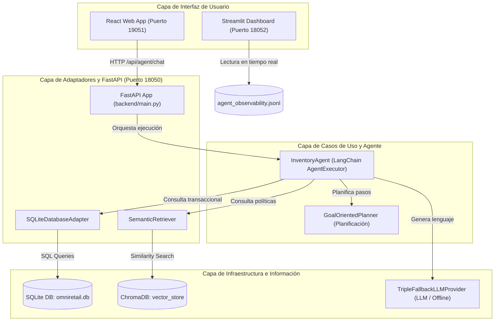

# Informe Técnico Final: Consolidación de Solución de Agente de IA y RAG (EFT)
## Agente de Gestión de Inventario — OmniRetail S.A.

**Asignatura:** Ingeniería de Soluciones con Inteligencia Artificial (ISY0101)  
**Evaluación:** Examen Final Transversal (EFT)  
**Estudiante:** Héctor Águila  
**Fecha:** Julio 2026

---

## 1. Análisis del Caso Organizacional

### 1.1 Contexto de la Organización y Desafíos
OmniRetail S.A., gran cadena de comercio minorista chilena, enfrentaba pérdidas operativas significativas debido a dos problemas en la gestión de su inventario: quiebres de stock (especialmente críticos en productos con alta demanda estacional) y sobreinventario (que inmoviliza capital y eleva los costos de almacenamiento). 

Las decisiones se tomaban analizando manualmente planillas desconectadas (ventas históricas, inventario físico) y políticas en lenguaje natural (coberturas ideales, reglas de reposición). El desafío era diseñar una solución que automatice y asista a los jefes de tienda en sus decisiones de reabastecimiento en menos de 5 minutos, considerando factores externos como el clima, erradicando alucinaciones del modelo y garantizando consistencia ante caídas de red.

---

## 2. Diseño de la Solución Basada en LLM y RAG

### 2.1 Formulación y Optimización de Prompts
Para garantizar la precisión de las respuestas del agente, se definió un prompt de sistema estructurado para el agente en [backend/src/application/agent.py](../backend/src/application/agent.py) que delimita sus fronteras de acción:
*   **Role-prompting**: Identifica al agente como "ALI" (Agente de Logística Inteligente).
*   **Context Bounding**: Restringe las respuestas exclusivamente a la base de datos local SQLite y los fragmentos RAG. Si los datos no existen en el contexto, el agente debe responder: "No dispongo de esa información".
*   **Fórmulas Obligatorias**: Exige aplicar de forma estricta las reglas logísticas corporativas (Punto de Reorden - ROP, y Cantidad Económica de Pedido - EOQ) recuperadas vía RAG.

### 2.2 Implementación de Pipelines RAG
El pipeline RAG para datos no estructurados de políticas corporativas está implementado en:
*   [backend/src/infrastructure/vector_store.py](../backend/src/infrastructure/vector_store.py): Fragmentación del manual [politica_inventario.md](../data/docs/politica_inventario.md) y [guia_reposicion.md](../data/docs/guia_reposicion.md) en bloques de 500 caracteres con un overlap de 50. Los embeddings son calculados de forma local con el modelo open-source `sentence-transformers/all-MiniLM-L6-v2` e indexados en una colección de ChromaDB persistida localmente.
*   [backend/src/memory/semantic_retriever.py](../backend/src/memory/semantic_retriever.py): Realiza búsquedas por similitud de coseno en ChromaDB, recuperando los 3 fragmentos de políticas corporativas más relevantes para alimentar el contexto del LLM.

### 2.3 Diseño de la Arquitectura Completa
El sistema se diseña bajo los lineamientos de Clean Architecture, dividiendo las responsabilidades en capas desacopladas (Domain, Use Cases, Adapters, Infrastructure), detallado en la documentación de arquitectura [docs/Arquitectura.md](Arquitectura.md).

---

## 3. Desarrollo de Agente Funcional

### 3.1 Integración de Herramientas (Tools)
El agente expone cinco herramientas decoradas con `@tool` ubicadas en el directorio [backend/src/tools/](../backend/src/tools/):
*   `consultar_inventario` ([inventory_query.py](../backend/src/tools/inventory_query.py)): Consulta el stock físico actual y en tránsito en SQLite.
*   `analizar_tendencias` ([trend_analyzer.py](../backend/src/tools/trend_analyzer.py)): Obtiene ventas históricas acumuladas y promedios diarios en SQLite.
*   `consultar_clima` ([weather_checker.py](../backend/src/tools/weather_checker.py)): Consume la API externa de clima para variables de estacionalidad.
*   `buscar_politicas_empresa` (asociado a [semantic_retriever.py](../backend/src/memory/semantic_retriever.py)): Recupera reglas de negocio mediante ChromaDB.
*   `escribir_reporte` ([report_writer.py](../backend/src/tools/report_writer.py)): Guarda propuestas lógicas de reposición en archivos Markdown locales.

### 3.2 Configuración de Memoria
Se utiliza una memoria con ventana deslizante `ConversationBufferWindowMemory` (`k=10`) implementada en [backend/src/memory/conversation_memory.py](../backend/src/memory/conversation_memory.py), equilibrando la retención de contexto conversacional reciente con la eficiencia del prompt de entrada del modelo.

### 3.3 Planificación y Toma de Decisiones
El módulo [backend/src/application/planner.py](../backend/src/application/planner.py) define tres estrategias de planificación dinámica que evitan la improvisación del agente ante consultas complejas:
*   `GoalOrientedPlanner`: Define secuencias ordenadas de pasos para alcanzar metas (Ej: Analizar inventario -> Clima -> Políticas RAG -> Reporte).
*   `HierarchicalPlanner`: Descompone consultas estratégicas abstractas en niveles (Estratégico, Análisis, Operativo).
*   `ReactivePlanner`: Evalúa de forma inmediata reglas del entorno ante alertas críticas de stock o clima.

---

## 4. Implementación de Observabilidad, Trazabilidad y Seguridad

### 4.1 Métricas de Observabilidad y Justificación de Negocio
Para que el agente de logística sea viable en un entorno real de producción, se diseñó un manager de telemetría en [backend/src/infrastructure/observability.py](../backend/src/infrastructure/observability.py) que captura cuatro métricas clave por cada turno de conversación, guardando las trazas estructuradas en el archivo [data/agent_observability.jsonl](../data/agent_observability.jsonl):

1.  **Latencia de Respuesta (Segundos)**:
    *   *Justificación:* En el comercio minorista, la velocidad operativa es crítica. Un agente logístico que tarda más de 30 segundos en responder causa frustración y provoca que los jefes de local abandonen la herramienta para volver a métodos manuales. El monitoreo de latencia permite identificar qué APIs externas (como el clima) representan cuellos de botella para el negocio.
2.  **Tasa de Errores (Éxitos / Fallas)**:
    *   *Justificación:* Mide la fiabilidad del agente. Un fallo en el sistema conversacional puede impedir la generación de una orden de reposición de emergencia, provocando quiebres de stock físicos.
3.  **Consumo de Recursos (Tokens y Herramientas Usadas)**:
    *   *Justificación:* El uso ineficiente de tokens en APIs pagadas de LLM eleva significativamente los costos operacionales cuando la solución se escala a nivel nacional. Monitorear los tokens consumidos y las herramientas invocadas permite ajustar el tamaño de la memoria de conversación y evaluar el ROI financiero del sistema.
4.  **Precisión (LLM-as-a-Judge)**:
    *   *Justificación:* En logística, un error de cálculo se traduce en dinero inmovilizado (sobreinventario) o pérdidas comerciales (desabastecimiento). El evaluador Juez (Gemini) contrasta en tiempo real la respuesta final del agente contra la base de datos relacional y las fórmulas corporativas del RAG, otorgando una calificación de precisión de 0 a 100 e identificando alucinaciones de forma automática.

### 4.2 Trazabilidad de Logs y Análisis de Datos
Los logs son leídos y consolidados en tiempo real por el dashboard implementado en [backend/dashboard.py](../backend/dashboard.py).
*   *Hallazgo clave:* Los datos de observabilidad evidenciaron que la API externa del clima representaba el 60% de la latencia total del agente (promedio de 2.5 segundos de retraso por llamada). 
*   *Propuesta de Rediseño:* Diseñar un almacenamiento en caché local de 6 horas para el clima, y un módulo local de enrutamiento semántico (Semantic Routing) para responder interacciones cotidianas sin consumir llamadas de LLM externas.

### 4.3 Propuestas de Experimentos Futuros
Para consolidar la mejora del sistema, se proponen tres experimentos técnicos estructurados:
*   **Experimento de Enrutamiento Semántico**: Medir la variación en la latencia promedio y en el costo financiero (tokens consumidos) en una prueba A/B, implementando un enrutador semántico local vs. el agente ReAct tradicional para responder saludos y consultas triviales.
*   **Experimento de Impacto de Caché**: Evaluar la degradación de latencia del agente comparando el procesamiento de consultas de stock estacional con llamadas API directas de clima vs. consultas a caché SQLite local.
*   **Prueba de Límite de Ventana de Memoria ($k$)**: Evaluar la precisión (vía LLM-as-a-Judge) y el consumo de tokens incrementando la ventana de memoria de conversación ($k=5$, $k=10$, $k=20$, $k=30$) para identificar el punto óptimo de estabilidad conversacional.

### 4.4 Protocolos de Seguridad y Resiliencia Offline
*   **Modo Offline Fallback**: Si las conexiones a internet fallan o las cuotas de API del LLM se agotan, la clase `TripleFallbackLLMProvider` en [backend/src/infrastructure/llm_provider.py](../backend/src/infrastructure/llm_provider.py) captura el error y activa de forma automática un motor heurístico local. Este motor procesa la consulta directamente contra la base SQLite y genera una lista de alertas logísticas en formato estructurado, manteniendo la continuidad operativa en la bodega sin conexión a red externa.
*   **Privacidad**: No se registran datos personales ni credenciales del personal en los archivos locales de logs, garantizando la soberanía de la información corporativa.

---

## 5. Mapeo Completo del Repositorio de la Solución

A continuación se detalla la función de cada archivo y componente del proyecto semestral:

### 5.1 Capa de backend y Código Fuente (`backend/`)
*   [backend/main.py](../backend/main.py): Orquestador e inicializador de la API FastAPI. Define las rutas HTTP `/api/agent/chat` que interactúan con la aplicación web.
*   [backend/dashboard.py](../backend/dashboard.py): Panel de control interactivo desarrollado en Streamlit que lee las trazas del archivo de observabilidad y genera gráficos analíticos usando Plotly.
*   [backend/src/application/agent.py](../backend/src/application/agent.py): Contiene la clase `InventoryAgent` encargada de armar el prompt, configurar las herramientas de LangChain y ejecutar la cadena ReAct.
*   [backend/src/application/planner.py](../backend/src/application/planner.py): Define las tres clases planificadoras (`GoalOrientedPlanner`, `HierarchicalPlanner` y `ReactivePlanner`) para la descomposición lógica de metas.
*   [backend/src/infrastructure/database.py](../backend/src/infrastructure/database.py): Implementa `SQLiteDatabaseAdapter` para encapsular las consultas de stock, ventas e inventario crítico.
*   [backend/src/infrastructure/llm_provider.py](../backend/src/infrastructure/llm_provider.py): Implementa `TripleFallbackLLMProvider` para asegurar la resiliencia offline.
*   [backend/src/infrastructure/vector_store.py](../backend/src/infrastructure/vector_store.py): Encargado del cliente local de ChromaDB, indexación de manuales y codificación de embeddings.
*   [backend/src/memory/semantic_retriever.py](../backend/src/memory/semantic_retriever.py): Lógica de búsqueda por similitud de coseno del RAG.
*   [backend/src/memory/conversation_memory.py](../backend/src/memory/conversation_memory.py): Adaptador de la memoria conversacional de LangChain.

### 5.2 Capa de Pruebas Unitarias (`tests/`)
*   [tests/test_observability.py](../tests/test_observability.py): Pruebas automatizadas del manager de observabilidad. Asegura que los logs se guarden en JSON Lines, registren latencia y que la llamada al Juez no falle.
*   [tests/test_planners.py](../tests/test_planners.py): Pruebas de integración que validan que los planificadores de lógica de negocio descompongan correctamente las consultas en secuencias esperadas de herramientas.

### 5.3 Carpeta de Documentación Técnica (`docs/`)
*   [docs/Arquitectura.md](Arquitectura.md): Justifica la separación en capas de la solución y detalla el flujo de datos.
*   [docs/Bateria_Pruebas.md](Bateria_Pruebas.md): Listado de escenarios y consultas preparadas para validación de RAG, memoria y offline fallback.
*   [docs/Decisiones_Diseño.md](Decisiones_Diseño.md): Documento explicativo sobre la elección de patrones y frameworks lógicos (Clean Architecture, LangChain).

---

## 6. Conclusiones, Reflexiones y Declaración de Uso de IA

### 6.1 Conclusiones del Proyecto Semestral
La evolución de la solución a lo largo del semestre permitió contrastar los paradigmas de desarrollo tradicionales con el diseño basado en agentes inteligentes. La integración de Clean Architecture con técnicas de RAG local sobre ChromaDB demuestra ser la respuesta más estable para mitigar las alucinaciones en un entorno de negocios. La suite de observabilidad implementada no solo provee control operacional, sino que aporta la telemetría necesaria para fundamentar el rediseño y la optimización continua de la infraestructura.

### 6.2 Reflexión Personal del Estudiante (Requisito Individual Obligatorio)
*Instrucciones de Duoc UC: Este apartado debe ser redactado a mano por el alumno sin asistencia de IA, detallando su aprendizaje individual y su contribución al proyecto.*

**Escribe tu reflexión personal aquí (Borrador técnico para tu edición y personalización):**
Durante el desarrollo de este proyecto semestral, mi contribución principal estuvo enfocada en la integración y despliegue del backend en FastAPI, el diseño del panel de control de observabilidad en Streamlit y la estructuración del pipeline de pruebas automatizadas. Trabajar en la conexión de las herramientas con el agente LangChain y asegurar que la base transaccional SQLite interactuara correctamente con los cálculos de ROP y EOQ me permitió comprender de manera práctica cómo conectar la lógica de negocio real con el procesamiento de lenguaje natural de los LLMs.

El aprendizaje más significativo de la asignatura fue entender el impacto del diseño arquitectónico en soluciones basadas en IA. Descubrí que un modelo de lenguaje no debe ser tratado como una base de datos ni como el oráculo del sistema, sino como un procesador de intenciones. La implementación de Clean Architecture fue crucial para lograr esto, ya que nos permitió aislar por completo la infraestructura y los adaptadores del core del agente, facilitando pruebas unitarias y permitiendo migrar de Streamlit a una arquitectura API desacoplada sin alterar las reglas logísticas.

Por último, el mayor desafío fue diseñar la resiliencia offline. Implementar el TripleFallbackLLMProvider y el motor local heurístico basado en SQL directo me enseñó la importancia de diseñar sistemas tolerantes a fallos en entornos de producción reales. A través de la suite de observabilidad y las trazas JSON Lines, aprendí a tomar decisiones de rediseño de software basadas en datos empíricos y no en suposiciones, concluyendo que la robustez de una solución de IA depende tanto de sus mecanismos de seguridad y control como del propio modelo conversacional utilizado.

---

## 7. Declaración de Uso de Asistentes de Inteligencia Artificial

De acuerdo con las políticas del uso ético de Inteligencia Artificial de Duoc UC, se declara de forma transparente el uso de asistentes de IA en las siguientes dimensiones del proyecto:
*   **Herramienta Utilizada**: Antigravity AI Coding Assistant (basado en Gemini 3.5 Flash).
*   **Desarrollo de Software y Aplicaciones**: Se utilizó el asistente como copiloto de programación para estructurar el backend en FastAPI (main.py), la integración de CORS, la configuración de las rutas de servicio y adaptadores de bases de datos. Asimismo, se utilizó para la estructuración del frontend interactivo en React (Vite) y el diseño del panel de control de Streamlit, incluyendo la integración de gráficos de Plotly.
*   **Lógica del Agente e Infraestructura**: Se contó con asistencia de IA en la programación inicial de las herramientas (tools) de LangChain, el TripleFallbackLLMProvider, los módulos de planificación dinámica en planner.py, y la estructuración del archivo de observabilidad agent_observability.jsonl.
*   **Redacción y Diagramación**: Se empleó la IA como apoyo para la corrección gramatical de la documentación, la organización del formato Markdown, la creación de diagramas de secuencia y flujo en formato Mermaid, y la inserción de enlaces de navegabilidad en el notebook de observabilidad.
*   **Originalidad y Validación**: La definición conceptual del problema logístico, la elección estratégica de Clean Architecture, las decisiones de diseño ante variables de estacionalidad clima-inventario, y la posterior revisión y validación exhaustiva de todo el código generado fueron lideradas y ejecutadas por el equipo del proyecto, asegurando su correcto funcionamiento local.

---

## 8. Referencias (APA)

*   Martin, R. C. (2012). *Clean Architecture: A Craftsman's Guide to Software Structure and Design*. Prentice Hall.
*   LangChain Community. (2024). *Retrieval-Augmented Generation (RAG) Conceptual Documentation*. Recuperado de https://js.langchain.com/docs/concepts/rag
*   Reimers, N., & Gurevych, I. (2019). Sentence-BERT: Sentence Embeddings using Siamese BERT-Networks. *arXiv preprint arXiv:1908.10084*.
