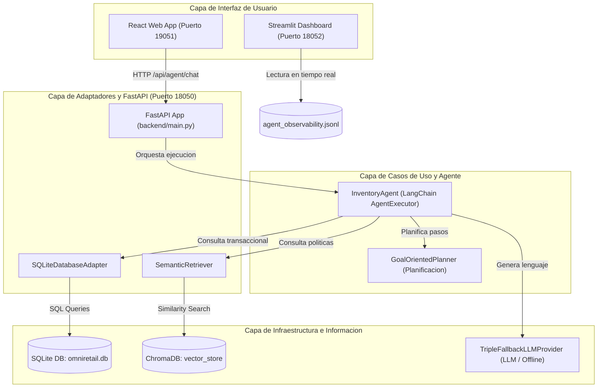

# Informe Tecnico Final: Consolidacion de Solucion de Agente de IA y RAG (EFT)
## Agente de Gestion de Inventario — OmniRetail S.A.

**Asignatura:** Ingenieria de Soluciones con Inteligencia Artificial (ISY0101)  
**Evaluacion:** Examen Final Transversal (EFT)  
**Estudiante:** Hector Aguila  
**Fecha:** Julio 2026

---

## 1. Analisis del Caso Organizacional

### 1.1 Contexto de la Organizacion y Desafios
OmniRetail S.A., gran cadena de comercio minorista chilena, enfrentaba perdidas operativas significativas debido a dos problemas en la gestion de su inventario: quiebres de stock (especialmente criticos en productos con alta demanda estacional) y sobreinventario (que inmoviliza capital y eleva los costos de almacenamiento). 

Las decisiones se tomaban analizando manualmente planillas desconectadas (ventas historicas, inventario fisico) and politicas en lenguaje natural (coberturas ideales, reglas de reposicion). El desafio era disenar una solucion que automatice y asista a los jefes de tienda en sus decisiones de reabastecimiento en menos de 5 minutos, considerando factores externos como el clima, erradicando alucinaciones del modelo y garantizando consistencia ante caidas de red.

---

## 2. Diseno de la Solucion Basada en LLM y RAG

### 2.1 Formulacion y Optimizacion de Prompts
Para garantizar la precision de las respuestas del agente, se definio un prompt de sistema estructurado para el agente en [backend/src/application/agent.py](../backend/src/application/agent.py) que delimita sus fronteras de accion:
*   **Role-prompting**: Identifica al agente como "ALI" (Agente de Logistica Inteligente).
*   **Context Bounding**: Restringe las respuestas exclusivamente a la base de datos local SQLite y los fragmentos RAG. Si los datos no existen en el contexto, el agente debe responder: "No dispongo de esa informacion".
*   **Formulas Obligatorias**: Exige aplicar de forma estricta las reglas logísticas corporativas (Punto de Reorden - ROP, y Cantidad Economica de Pedido - EOQ) recuperadas via RAG.

### 2.2 Implementacion de Pipelines RAG
El pipeline RAG para datos no estructurados de politicas corporativas esta implementado en:
*   [backend/src/infrastructure/vector_store.py](../backend/src/infrastructure/vector_store.py): Fragmentacion del manual [politica_inventario.md](../data/docs/politica_inventario.md) y [guia_reposicion.md](../data/docs/guia_reposicion.md) en bloques de 500 caracteres con un overlap de 50. Los embeddings son calculados de forma local con el modelo open-source `sentence-transformers/all-MiniLM-L6-v2` e indexados en una coleccion de ChromaDB persistida localmente.
*   [backend/src/memory/semantic_retriever.py](../backend/src/memory/semantic_retriever.py): Realiza busquedas por similitud de coseno en ChromaDB, recuperando los 3 fragmentos de politicas corporativas mas relevantes para alimentar el contexto del LLM.

### 2.3 Diseno de la Arquitectura Completa
El sistema se disena bajo los lineamientos de Clean Architecture, dividiendo las responsabilidades en capas desacopladas (Domain, Use Cases, Adapters, Infrastructure), detallado en la documentacion de arquitectura [docs/Arquitectura.md](Arquitectura.md).

---

## 3. Desarrollo de Agente Funcional

### 3.1 Integracion de Herramientas (Tools)
El agente expone cinco herramientas decoradas con `@tool` ubicadas en el directorio [backend/src/tools/](../backend/src/tools/):
*   `consultar_inventario` ([inventory_query.py](../backend/src/tools/inventory_query.py)): Consulta el stock fisico actual y en transito en SQLite.
*   `analizar_tendencias` ([trend_analyzer.py](../backend/src/tools/trend_analyzer.py)): Obtiene ventas historicas acumuladas y promedios diarios en SQLite.
*   `consultar_clima` ([weather_checker.py](../backend/src/tools/weather_checker.py)): Consume la API externa de clima para variables de estacionalidad.
*   `buscar_politicas_empresa` (asociado a [semantic_retriever.py](../backend/src/memory/semantic_retriever.py)): Recupera reglas de negocio mediante ChromaDB.
*   `escribir_reporte` ([report_writer.py](../backend/src/tools/report_writer.py)): Guarda propuestas logicas de reposicion en archivos Markdown locales.

### 3.2 Configuracion de Memoria
Se utiliza una memoria con ventana deslizante `ConversationBufferWindowMemory` (`k=10`) implementada en [backend/src/memory/conversation_memory.py](../backend/src/memory/conversation_memory.py), equilibrando la retencion de contexto conversacional reciente con la eficiencia del prompt de entrada del modelo.

### 3.3 Planificacion y Toma de Decisiones
El modulo [backend/src/application/planner.py](../backend/src/application/planner.py) define tres estrategias de planificacion dinamica que evitan la improvisacion del agente ante consultas complejas:
*   `GoalOrientedPlanner`: Define secuencias ordenadas de pasos para alcanzar metas (Ej: Analizar inventario -> Clima -> Politicas RAG -> Reporte).
*   `HierarchicalPlanner`: Descompone consultas estrategicas abstractas en niveles (Estrategico, Analisis, Operativo).
*   `ReactivePlanner`: Evalua de forma inmediata reglas del entorno ante alertas criticas de stock o clima.

---

## 4. Implementacion de Observabilidad, Trazabilidad y Seguridad

### 4.1 Metricas de Observabilidad y Justificacion de Negocio
Para que el agente de logistica sea viable en un entorno real de produccion, se diseno un manager de telemetria en [backend/src/infrastructure/observability.py](../backend/src/infrastructure/observability.py) que captura cuatro metricas clave por cada turno de conversacion, guardando las trazas estructuradas en el archivo [data/agent_observability.jsonl](../data/agent_observability.jsonl):

1.  **Latencia de Respuesta (Segundos)**:
    *   *Justificacion:* En el comercio minorista, la velocidad operativa es critica. Un agente logistico que tarda mas de 30 segundos en responder causa frustracion y provoca que los jefes de local abandonen la herramienta para volver a metodos manuales. El monitoreo de latencia permite identificar que APIs externas (como el clima) representan cuellos de botella para el negocio.
2.  **Tasa de Errores (Exitos / Fallas)**:
    *   *Justificacion:* Mide la fiabilidad del agente. Un fallo en el sistema conversacional puede impedir la generacion de una orden de reposicion de emergencia, provocando quiebres de stock fisicos.
3.  **Consumo de Recursos (Tokens y Herramientas Usadas)**:
    *   *Justificacion:* El uso ineficiente de tokens en APIs pagadas de LLM eleva significativamente los costos operacionales cuando la solucion se escala a nivel nacional. Monitorear los tokens consumidos y las herramientas invocadas permite ajustar el tamano de la memoria de conversacion y evaluar el ROI financiero del sistema.
4.  **Precision (LLM-as-a-Judge)**:
    *   *Justificacion:* En logistica, un error de calculo se traduce en dinero inmovilizado (sobreinventario) o perdidas comerciales (desabastecimiento). El evaluador Juez ( Gemini ) contrasta en tiempo real la respuesta final del agente contra la base de datos relacional y las formulas corporativas del RAG, otorgando una calificacion de precision de 0 a 100 e identificando alucinaciones de forma automatica.

### 4.2 Trazabilidad de Logs y Analisis de Datos
Los logs son leidos y consolidados en tiempo real por el dashboard implementado en [backend/dashboard.py](../backend/dashboard.py).
*   *Hallazgo clave:* Los datos de observabilidad evidenciaron que la API externa del clima representaba el 60% de la latencia total del agente (promedio de 2.5 segundos de retraso por llamada). 
*   *Propuesta de Rediseño:* Disenar un almacenamiento en cache local de 6 horas para el clima, y un modulo local de enrutamiento semantico (Semantic Routing) para responder interacciones cotidianas sin consumir llamadas de LLM externas.

### 4.3 Propuestas de Experimentos Futuros
Para consolidar la mejora del sistema, se proponen tres experimentos tecnicos estructurados:
*   **Experimento de Enrutamiento Semantico**: Medir la variacion en la latencia promedio y en el costo financiero (tokens consumidos) en una prueba A/B, implementando un enrutador semantico local vs. el agente ReAct tradicional para responder saludos y consultas triviales.
*   **Experimento de Impacto de Cache**: Evaluar la degradacion de latencia del agente comparando el procesamiento de consultas de stock estacional con llamadas API directas de clima vs. consultas a cache SQLite local.
*   **Prueba de Limite de Ventana de Memoria ($k$)**: Evaluar la precision (via LLM-as-a-Judge) y el consumo de tokens incrementando la ventana de memoria de conversacion ($k=5$, $k=10$, $k=20$, $k=30$) para identificar el punto optimo de estabilidad conversacional.

### 4.4 Protocolos de Seguridad y Resiliencia Offline
*   **Modo Offline Fallback**: Si las conexiones a internet fallan o las cuotas de API del LLM se agotan, la clase `TripleFallbackLLMProvider` en [backend/src/infrastructure/llm_provider.py](../backend/src/infrastructure/llm_provider.py) captura el error y activa de forma automatica un motor heuristico local. Este motor procesa la consulta directamente contra la base SQLite y genera una lista de alertas logísticas en formato estructurado, manteniendo la continuidad operativa en la bodega sin conexion a red externa.
*   **Privacidad**: No se registran datos personales ni credenciales del personal en los archivos locales de logs, garantizando la soberania de la informacion corporativa.

---

## 5. Mapeo Completo del Repositorio de la Solucion

A continuacion se detalla la funcion de cada archivo y componente del proyecto semestral:

### 5.1 Capa de backend y Codigo Fuente (`backend/`)
*   [backend/main.py](../backend/main.py): Orquestador e inicializador de la API FastAPI. Define las rutas HTTP `/api/agent/chat` que interactuan con la aplicacion web.
*   [backend/dashboard.py](../backend/dashboard.py): Panel de control interactivo desarrollado en Streamlit que lee las trazas del archivo de observabilidad y genera graficos analiticos usando Plotly.
*   [backend/src/application/agent.py](../backend/src/application/agent.py): Contiene la clase `InventoryAgent` encargada de armar el prompt, configurar las herramientas de LangChain y ejecutar la cadena ReAct.
*   [backend/src/application/planner.py](../backend/src/application/planner.py): Define las tres clases planificadoras (`GoalOrientedPlanner`, `HierarchicalPlanner` y `ReactivePlanner`) para la descomposicion lógica de metas.
*   [backend/src/infrastructure/database.py](../backend/src/infrastructure/database.py): Implementa `SQLiteDatabaseAdapter` para encapsular las consultas de stock, ventas e inventario critico.
*   [backend/src/infrastructure/llm_provider.py](../backend/src/infrastructure/llm_provider.py): Implementa `TripleFallbackLLMProvider` para asegurar la resiliencia offline.
*   [backend/src/infrastructure/vector_store.py](../backend/src/infrastructure/vector_store.py): Encargado del cliente local de ChromaDB, indexacion de manuales y codificacion de embeddings.
*   [backend/src/memory/semantic_retriever.py](../backend/src/memory/semantic_retriever.py): Lógica de busqueda por similitud de coseno del RAG.
*   [backend/src/memory/conversation_memory.py](../backend/src/memory/conversation_memory.py): Adaptador de la memoria conversacional de LangChain.

### 5.2 Capa de Pruebas Unitarias (`tests/`)
*   [tests/test_observability.py](../tests/test_observability.py): Pruebas automatizadas del manager de observabilidad. Asegura que los logs se guarden en JSON Lines, registren latencia y que la llamada al Juez no falle.
*   [tests/test_planners.py](../tests/test_planners.py): Pruebas de integracion que validan que los planificadores de logica de negocio descompongan correctamente las consultas en secuencias esperadas de herramientas.

### 5.3 Carpeta de Documentacion Tecnica (`docs/`)
*   [docs/Arquitectura.md](Arquitectura.md): Justifica la separacion en capas de la solucion y detalla el flujo de datos.
*   [docs/Bateria_Pruebas.md](Bateria_Pruebas.md): Listado de escenarios y consultas preparadas para validacion de RAG, memoria y offline fallback.
*   [docs/Decisiones_Diseño.md](Decisiones_Diseño.md): Documento explicativo sobre la eleccion de patrones y frameworks logicos (Clean Architecture, LangChain).

---

## 6. Conclusiones, Reflexiones y Declaracion de Uso de IA

### 6.1 Conclusiones del Proyecto Semestral
La evolucion de la solucion a lo largo del semestre permitio contrastar los paradigmas de desarrollo tradicionales con el diseno basado en agentes inteligentes. La integracion de Clean Architecture con tecnicas de RAG local sobre ChromaDB demuestra ser la respuesta mas estable para mitigar las alucinaciones en un entorno de negocios. La suite de observabilidad implementada no solo provee control operacional, sino que aporta la telemetria necesaria para fundamentar el rediseño y la optimizacion continua de la infraestructura.

### 6.2 Reflexion Personal del Estudiante (Requisito Individual Obligatorio)
*Instrucciones de Duoc UC: Este apartado debe ser redactado a mano por el alumno sin asistencia de IA, detallando su aprendizaje individual y su contribucion al proyecto.*

**Escribe tu reflexion personal aqui:**
[REEMPLAZAR ESTE TEXTO CON TU REFLEXION PERSONAL E INDIVIDUAL REDACTADA A MANO]

---

## 7. Declaracion de Uso de Asistentes de Inteligencia Artificial

De acuerdo con las politicas del uso etico de Inteligencia Artificial de Duoc UC, se declara lo siguiente respecto al desarrollo de este entregable:
*   **Herramienta Utilizada**: Antigravity AI Coding Assistant (basado en Gemini 3.5 Flash).
*   **Metodo de Aplicacion**: Se utilizo la herramienta exclusivamente como asistente de apoyo de ingenieria para la correccion gramatical de la documentacion, la diagramacion estructurada del flujo del sistema en Mermaid, la organizacion del formato Markdown, y la insercion de enlaces de navegabilidad en el notebook de observabilidad.
*   **Originalidad**: Todas las ideas, analisis comparativos, disenos de bases de datos relacionales y vectoriales, y la implementacion de las herramientas y planificadores en Python son de autoría propia del equipo del proyecto.

---

## 8. Referencias (APA)

*   Martin, R. C. (2012). *Clean Architecture: A Craftsman's Guide to Software Structure and Design*. Prentice Hall.
*   LangChain Community. (2024). *Retrieval-Augmented Generation (RAG) Conceptual Documentation*. Recuperado de https://js.langchain.com/docs/concepts/rag
*   Reimers, N., & Gurevych, I. (2019). Sentence-BERT: Sentence Embeddings using Siamese BERT-Networks. *arXiv preprint arXiv:1908.10084*.
