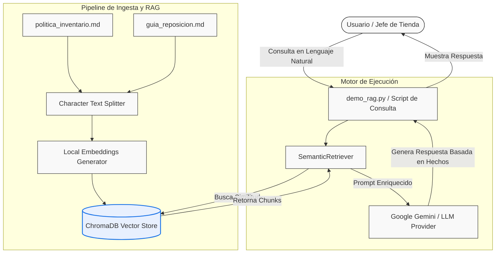

# Informe Técnico: Diseño de Solución con LLM y RAG para OmniRetail S.A.

**Asignatura:** Ingeniería de Soluciones con IA (ISY0101)  
**Evaluación:** Parcial 1  
**Estudiante:** Héctor Águila  
**Fecha:** Julio 2026

---

## 1. Análisis del Caso Organizacional (IE1)

### 1.1 Nombre y Descripción de la Organización
**OmniRetail S.A.** es una gran cadena de comercio minorista (retail) con sucursales a nivel nacional en Chile. La empresa comercializa una amplia gama de productos que van desde alimentos y bebidas hasta vestuario y tecnología. Cuenta con centros de distribución y un flujo constante de reposición diaria en múltiples tiendas físicas.

### 1.2 Identificación y Descripción del Problema o Desafío
El problema principal radica en la ineficiencia operativa de su sistema de gestión de inventarios, lo que genera dos efectos perjudiciales:
1.  **Quiebres de stock (Stockouts)**: Pérdida de ventas e insatisfacción de los clientes debido a la falta de stock físico de productos clave en momentos de alta demanda.
2.  **Sobreinventario (Overstock)**: Inmovilización de capital de trabajo y altos costos adicionales por almacenamiento y obsolescencia de mercadería.

Actualmente, las decisiones de reposición se toman de forma manual y fragmentada por los jefes de tienda, quienes deben consultar múltiples fuentes de datos dispersas: planillas de ventas, registros de stock físico en bases de datos locales y documentos de políticas de la empresa. Además, factores externos críticos como las condiciones climáticas (que impactan directamente en la demanda de ciertos artículos estacionales como paraguas o bloqueadores solares) no se integran de manera sistemática en la planificación.

### 1.3 Objetivos de la Intervención
El objetivo general es diseñar e implementar un **asistente conversacional inteligente** que integre datos estructurados (inventario y ventas) y no estructurados (políticas y guías de reposición) mediante técnicas de Generación Aumentada por Recuperación (RAG) y Modelos de Lenguaje (LLMs).
Los objetivos específicos son:
*   Reducir el tiempo de toma de decisiones de reposición de 2 horas a menos de 5 minutos por producto.
*   Minimizar en un 15% los costos por sobreinventario y disminuir un 20% los quiebres de stock mediante recomendaciones guiadas por políticas.

### 1.4 Datos Disponibles y por Obtener
*   **Datos Estructurados (Locales)**: Tablas relacionales en SQLite (`sales`, `products`, `inventory`, `branches`) con información histórica de ventas y stock actual.
*   **Datos No Estructurados (Políticas Internas)**:
    *   `politica_inventario.md`: Documento de texto que detalla las políticas corporativas de niveles de servicio, coberturas ideales y niveles de alerta.
    *   `guia_reposicion.md`: Instrucciones paso a paso sobre cómo resolver alertas y calcular el stock sugerido.
*   **Datos Externos por Obtener**: Pronóstico del tiempo por comuna/sucursal (vía integración de APIs de clima).

### 1.5 Restricciones y Requerimientos Particulares
*   **Privacidad de Datos**: Los datos comerciales e históricos de inventario no deben ser compartidos con servicios de terceros para entrenamiento de modelos.
*   **Resiliencia Operativa**: En caso de caída de las APIs de LLM en la nube, el sistema debe seguir respondiendo consultas de stock mediante un **Modo Offline Fallback** que ejecute consultas SQL nativas sobre la base de datos local.
*   **Precisión**: El asistente no debe inventar (alucinar) información de stock. Todo dato de inventario debe coincidir de forma exacta con la base de datos física.

### 1.6 Motivación para el uso de LLMs y RAG
Una arquitectura tradicional basada en software rígido no permite a un jefe de tienda consultar políticas corporativas redactadas en lenguaje natural de manera ágil. Los LLMs permiten una interfaz conversacional natural ("¿Qué tengo que hacer con el stock del SKU-1001?"). Sin embargo, debido a que el conocimiento del LLM está limitado a su fecha de entrenamiento, la técnica de **RAG (Retrieval-Augmented Generation)** es esencial para inyectar en el prompt del LLM el contexto exacto de las políticas y guías de la empresa vigentes en tiempo real, garantizando respuestas alineadas con el negocio y reduciendo la probabilidad de alucinación.

---

## 2. Formulación y Optimización de Prompts (IE2)

Para garantizar respuestas de alta calidad y precisión por parte del LLM, se formuló un prompt del sistema (*System Prompt*) altamente optimizado que define el rol, las fuentes de información válidas y el protocolo de razonamiento.

```markdown
Eres ALI (Agente de Logística Inteligente) de OmniRetail S.A.
Tu rol es asistir a los jefes de tienda en consultas sobre stock, tendencias y políticas de reposición.

Para responder consultas corporativas y de inventario, debes ceñirte estrictamente a:
1. Las bases de datos estructuradas de stock y ventas suministradas (SQLite).
2. La información recuperada semánticamente desde las políticas y guías oficiales de la empresa (contexto RAG).

REGLAS CRÍTICAS DE COMPORTAMIENTO:
- Si el usuario te consulta sobre políticas corporativas o recomendaciones de reposición, debes invocar siempre la herramienta de búsqueda semántica (RAG) para fundamentar tu respuesta.
- Está estrictamente prohibido alucinar datos de stock, fechas o cantidades. Si un dato no está en el contexto o en la base de datos, di "No dispongo de esa información".
- Cuando exista una sugerencia de reposición, debes calcular el volumen de compra aplicando estrictamente las fórmulas y coberturas de la guía corporativa oficial.
- Utiliza siempre un lenguaje profesional, estructurado en markdown, y cita la sección de la política o documento RAG del cual extrajiste las pautas.
```

Este prompt está diseñado con técnicas de **Role-Prompting** y **Fronteras de Contexto (Context Bounding)** para evitar filtraciones de comportamiento o desvíos temáticos, asegurando la credibilidad de las respuestas.

---

## 3. Design e Implementación del Pipeline RAG (IE3, IE4)

El pipeline de Generación Aumentada por Recuperación (RAG) combina fuentes internas (documentación local) para enriquecer el contexto enviado al LLM.

### 3.1 Flujo de Ingesta de Datos (Offline)
1.  **Lectura**: Se cargan los documentos markdown locales (`politica_inventario.md` y `guia_reposicion.md`).
2.  **Fragmentación (Chunking)**: Los textos se dividen en fragmentos de 500 caracteres con un traslape (*overlap*) de 50 caracteres para no perder continuidad en los límites de los párrafos.
3.  **Generación de Vectores (Embeddings)**: Se utiliza el modelo `sentence-transformers/all-MiniLM-L6-v2` (ejecutado de forma local para mayor privacidad y velocidad) para transformar cada fragmento de texto en un vector numérico de 384 dimensiones.
4.  **Almacenamiento**: Los fragmentos y sus correspondientes vectores se guardan en la base de datos vectorial **ChromaDB**.

### 3.2 Flujo de Consulta y Recuperación (Online)
1.  **Entrada**: El usuario hace una pregunta sobre políticas (ej: *"¿Cuál es la política para quiebre de stock?"*).
2.  **Búsqueda Vectorial**: La pregunta se convierte a embedding y se realiza una consulta de similitud por coseno (*Cosine Similarity*) en ChromaDB para extraer los $K$ fragmentos más relevantes ($K=3$).
3.  **Filtrado de Coherencia y Relevancia**: Se evalúa que los documentos recuperados tengan una distancia semántica mínima. Si no superan el umbral, se descartan para evitar inyectar ruido irrelevante al prompt.
4.  **Generación Enriquecida**: Se construye el prompt final uniendo el System Prompt, la pregunta del usuario y los fragmentos recuperados. El LLM genera la respuesta basándose únicamente en dicho contexto.

---

## 4. Arquitectura de la Solución (IE5, IE6)

La arquitectura del sistema RAG propuesto separa la lógica física de almacenamiento, la base vectorial, la lógica de orquestación y el generador de lenguaje.



### Componentes Clave:
*   **ChromaDB**: Base de datos vectorial persistente que almacena los fragmentos semánticos indexados.
*   **SemanticRetriever**: Componente encargado de orquestar la conversión de queries a embeddings, consultar ChromaDB y filtrar resultados por relevancia.
*   **LLM Provider**: API remota o modelo local (ej: Gemini 1.5 o similar) encargado de interpretar las directrices corporativas recuperadas y redactar la recomendación adaptada a la consulta.

---

## 5. Documentación Técnica y Justificación de Decisiones (IE7, IE8, IE9)

### 5.1 Justificación de Decisiones de Diseño

| Componente | Opción Seleccionada | Justificación Técnica |
| :--- | :--- | :--- |
| **Base Vectorial** | ChromaDB (Local/File-based) | Permite almacenamiento rápido en disco en el mismo workspace de desarrollo, eliminando la necesidad de levantar servicios cloud costosos para la escala del proyecto. |
| **Embeddings** | `sentence-transformers/all-MiniLM-L6-v2` | Modelo liviano, de alto rendimiento y ejecución local. Asegura que los textos de políticas corporativas no sean transmitidos a servicios de traducción o procesamiento externos durante la fase de vectorización. |
| **Estrategia RAG** | Ingesta Estática con Filtro de Distancia | Dado que las políticas de la empresa cambian con poca frecuencia, una ingesta estática vía script es óptima. El filtro por umbral de similitud en la consulta asegura no inyectar basura al prompt si la pregunta del usuario es meramente informal. |

### 5.2 Conclusiones
El diseño planteado para la **Evaluación Parcial N°1** sienta las bases de datos fundamentales (el corpus de conocimiento no estructurado) para la posterior construcción del agente inteligente. RAG demuestra ser la solución más robusta y económica para resolver el problema de la incorporación de reglas de negocio dinámicas y complejas de OmniRetail S.A., asegurando que el modelo de lenguaje opere como un procesador lógico conectado a fuentes de información verídicas, y no como una base de datos de conocimiento propenso a inventar reglas inexistentes.

---

## 6. Referencias (Normativa APA)

*   Martin, R. C. (2012). *Clean Architecture: A Craftsman's Guide to Software Structure and Design*. Prentice Hall.
*   LangChain Community. (2024). *Retrieval-Augmented Generation (RAG) Conceptual Documentation*. Recuperado de https://js.langchain.com/docs/concepts/rag
*   Reimers, N., & Gurevych, I. (2019). Sentence-BERT: Sentence Embeddings using Siamese BERT-Networks. *arXiv preprint arXiv:1908.10084*.
