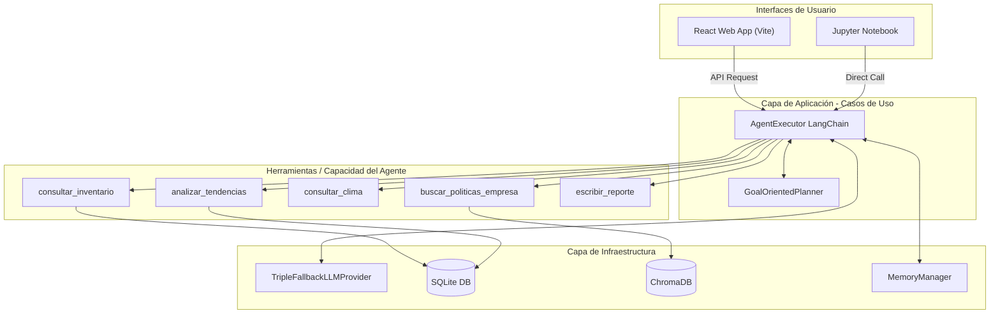

# Informe Técnico: Agente de Gestión de Inventario - OmniRetail S.A.

**Asignatura:** Ingeniería de Soluciones con IA (ISY0101)  
**Evaluación:** Parcial 2  
**Estudiante:** Héctor Águila  
**Fecha:** Junio 2026

---

## 1. Introducción y Contexto del Problema
OmniRetail S.A. se enfrenta a desafíos en la gestión de su inventario, sufriendo tanto por quiebres de stock como por sobreinventario, lo que resulta en la insatisfacción de los clientes y altos costos de almacenamiento. Actualmente, las decisiones se toman manualmente analizando múltiples planillas desconectadas (ventas, stock, proveedores) y sin considerar factores externos como el clima.

Este proyecto propone la construcción de un **Agente Inteligente Conversacional** que automatiza el análisis, consulta múltiples fuentes de datos estructurados (SQLite) y no estructurados (documentos de políticas vía RAG), para asistir a los jefes de tienda en la toma de decisiones óptimas de reposición.

## 2. Arquitectura de la Solución
El sistema ha sido estructurado bajo los lineamientos de **Clean Architecture** (Martin, 2012), separando rigurosamente las responsabilidades:

1.  **Capa de Dominio:** Entidades puras en Python (`dataclasses`) que representan conceptos como Productos, Ventas y Estado de Inventario.
2.  **Capa de Casos de Uso:** Orquestación central gestionada por `AgentExecutor` de LangChain y el `GoalOrientedPlanner`.
3.  **Capa de Adaptadores (Herramientas):** Un set de cinco funciones (`@tool`) que interactúan de puente entre el agente lógico y el mundo externo.
4.  **Capa de Infraestructura:** Las conexiones físicas hacia SQLite, ChromaDB y las APIs de los modelos LLM (GitHub Models y Gemini).

### 2.1 Diagrama de Arquitectura y Flujo

A continuación se detalla la estructura y la relación de comunicación entre las distintas capas del sistema:

Para ver detalles complementarios de esta estructura, se puede revisar el archivo independiente [Arquitectura.md](file:///home/hector/Escritorio/SolucionesIA/SolucionesIA/docs/Arquitectura.md).

## 3. Integración de Componentes Clave

### 3.1 Proveedor de LLM Tolerante a Fallos (Triple Fallback)
El núcleo inteligente se sostiene primariamente en **GitHub Models API** (`gpt-4o-mini`). Sin embargo, previendo restricciones de cuotas (rate limits) habituales en entornos de evaluación, la capa de infraestructura implementa el patrón **Triple Fallback**:
1.  Intento principal vía GitHub Models.
2.  Si falla, transición a Google Gemini API (modelo flash).
3.  Si la conectividad falla completamente, el sistema entra en modo de "emergencia offline", respondiendo mediante consultas directas SQL preprogramadas.

### 3.2 Sistema de Herramientas (Tooling)
El agente posee autonomía mediante las siguientes herramientas:
*   `consultar_inventario`: Consulta determinística a BD sobre estado de un SKU.
*   `analizar_tendencias`: Cálculo dinámico de ventas promedio.
*   `consultar_clima`: Factor externo condicionante para demanda.
*   `buscar_politicas_empresa`: Recuperación semántica.
*   `escribir_reporte`: Persistencia de decisiones en archivos Markdown.

### 3.3 Sistemas de Memoria
*   **A corto plazo:** Se utiliza `ConversationBufferWindowMemory` (k=10) de LangChain, asegurando que el agente recuerde el contexto de la conversación reciente (ej: "Analiza el stock de bloqueador" -> "¿Y para la tienda en Viña?") sin saturar la ventana de contexto del LLM.
*   **A largo plazo (RAG):** Implementado vía `ChromaDB` con el modelo de embeddings local `all-MiniLM-L6-v2`. Las políticas de seguridad y guías climáticas son fragmentadas e ingestadas, permitiendo que las recomendaciones del agente estén ancladas ("grounded") en las reglas reales del negocio.

## 4. Planificación y Orquestación

Siguiendo las estrategias de planificación avanzadas vistas en el módulo RA2 (IL2.3), se implementó un sistema de planificación dinámica que soporta tres modos de orquestación:
1.  **Planificación Orientada a Objetivos (`GoalOrientedPlanner`):** Descompone la solicitud del usuario en pasos lógicos secuenciales para alcanzar el fin deseado.
2.  **Planificación Jerárquica (`HierarchicalPlanner`):** Descompone metas complejas por niveles de abstracción (HIGH/Estratégico, MEDIUM/Análisis, LOW/Operativo de ejecución) y las prioriza correspondientemente.
3.  **Planificación Reactiva (`ReactivePlanner`):** Responde de manera inmediata y sin consumo de tokens a eventos críticos del entorno (ej. stock bajo o alertas de clima) aplicando reglas lógicas.

El agente analiza la solicitud e invoca la estrategia pertinente. A continuación, el flujo ReAct (Reason + Act) del `AgentExecutor` utiliza las herramientas y la memoria conversacional para responder de forma consistente y justificada.

## 5. Conclusión
El Agente de Gestión de Inventario demuestra cómo la integración estructurada de LLMs con bases de datos transaccionales (SQLite) y vectoriales (ChromaDB), empaquetado bajo Clean Architecture, puede resolver problemáticas reales de negocio. La solución transita exitosamente de ser un mero chatbot a un asistente de toma de decisiones accionado por datos.

## 6. Referencias
*   Martin, R. C. (2012). *The Clean Architecture*. Clean Coder Blog. https://blog.cleancoder.com/uncle-bob/2012/08/13/the-clean-architecture.html
*   Harrison, C. (2023). *LangChain Documentation*. LangChain. https://python.langchain.com/
